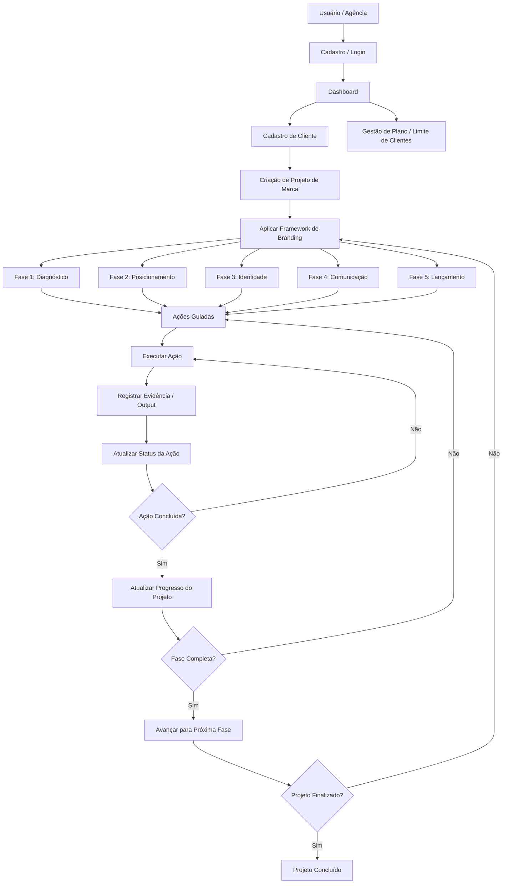

```mermaid
flowchart TD
    A[Usuário / Agência] --> B[Cadastro / Login]
    B --> C[Dashboard]

    C --> D[Cadastro de Cliente]
    D --> E[Criação de Projeto de Marca]

    E --> F[Aplicar Framework de Branding]
    F --> G[Fase 1: Diagnóstico]
    F --> H[Fase 2: Posicionamento]
    F --> I[Fase 3: Identidade]
    F --> J[Fase 4: Comunicação]
    F --> K[Fase 5: Lançamento]

    G --> L[Ações Guiadas]
    H --> L
    I --> L
    J --> L
    K --> L

    L --> M[Executar Ação]
    M --> N[Registrar Evidência / Output]
    N --> O[Atualizar Status da Ação]

    O --> P{Ação Concluída?}
    P -- Não --> M
    P -- Sim --> Q[Atualizar Progresso do Projeto]

    Q --> R{Fase Completa?}
    R -- Não --> L
    R -- Sim --> S[Avançar para Próxima Fase]

    S --> T{Projeto Finalizado?}
    T -- Não --> F
    T -- Sim --> U[Projeto Concluído]

    C --> V[Gestão de Plano / Limite de Clientes]
```
